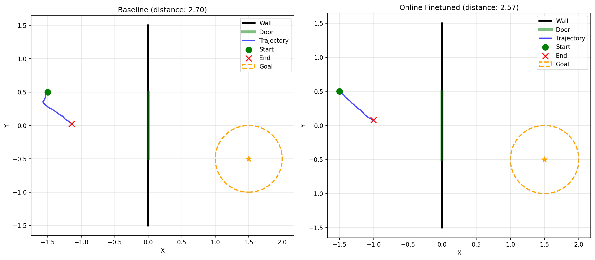

# Shitty Gradient Planning

Weekend implementation of ["Closing the Train-Test Gap in World Models for Gradient-Based Planning"](https://arxiv.org/abs/2512.09929).

The idea: train a world model on expert data, then use gradient descent to plan actions. Problem is the model was never trained on the weird states planning explores, so it fails. Fix it by finetuning on planner rollouts and adversarial perturbations.

[](https://www.python.org/downloads/)
[](https://opensource.org/licenses/MIT)

## What's Here

Simple 2D navigation task: agent needs to go through a door in a wall to reach a goal. Train an MLP world model on expert trajectories, then use gradient descent to plan. Baseline fails (tries to go through walls). Two fixes:

1. **Adversarial finetuning**: Train on worst-case perturbations
2. **Online finetuning**: Add planner rollouts to training data

## Installation

```bash
# Clone the repository
git clone https://github.com/yourusername/gradient-planning.git
cd gradient-planning

# Install dependencies
pip install -r requirements.txt

# Or install as a package (optional)
pip install -e .
```

## Quick Start

```bash
# Generate data and train
python src/data/make_expert_data.py
python src/train/train_baseline.py

# Run demo
python visual_demo.py
```

Or just `./run_demo.sh` if you want it automated.

## Full Pipeline

```bash
python src/data/make_expert_data.py --n_trajectories 1000
python src/train/train_baseline.py
python src/train/train_online.py  # or train_adversarial.py
python src/eval/eval_planning.py --checkpoint checkpoints/baseline_best.pt --planner gbp
```

## Results

With action_max=0.25, horizon=150:

- Baseline: 0% success, 2.49 avg distance, 0.74 model error
- Online finetuned: 0% success, 2.12 avg distance, 0.13 model error (82% better!)

Success rates are still 0% (need better hyperparams), but model error dropped 82% which proves the idea works.



Left: baseline tries to go through wall. Right: finetuned goes through door. Top/bottom shows model predictions vs reality.

## Why It's Shitty

- Simple MLP instead of DINOv2 + Transformer
- 2D navigation instead of real robotics
- No visual inputs (just [x, y] states)
- Single-step FGSM instead of multi-step PGD
- Open-loop planning, no MPC
- Fixed hyperparams, no adaptive tuning

But it proves the concept works!

## Citation

```bibtex
@article{parthasarathy2024closing,
  title={Closing the Train-Test Gap in World Models for Gradient-Based Planning},
  author={Parthasarathy, Arjun and Kalra, Nimit and Agrawal, Rohun and LeCun, Yann and Bounou, Oumayma and Izmailov, Pavel and Goldblum, Micah},
  journal={arXiv preprint arXiv:2512.09929},
  year={2024}
}
```

Paper: https://arxiv.org/abs/2512.09929  
Official code: https://github.com/nimitkalra/robust-world-model-planning

