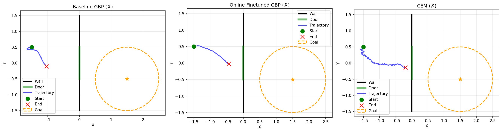

# Shitty Gradient Planning

Weekend implementation of ["Closing the Train-Test Gap in World Models for Gradient-Based Planning"](https://arxiv.org/abs/2512.09929).

**Gradient-based planning fails due to world model distribution shift. We show two minimal fixes.**

[](https://www.python.org/downloads/)
[](https://opensource.org/licenses/MIT)

## What's Here

Simple 2D navigation task: agent needs to go through a door in a wall to reach a goal. Train an MLP world model on expert trajectories, then use gradient descent to plan. Baseline fails (tries to go through walls). Two fixes:

1. **Adversarial finetuning**: Train on worst-case perturbations
2. **Online finetuning**: Add planner rollouts to training data

## Installation

```bash
git clone https://github.com/yourusername/gradient-planning.git
cd gradient-planning
pip install -r requirements.txt
```

## Quick Start

```bash
# One command to reproduce everything
python reproduce.py

# Or step by step
python src/data/make_expert_data.py
python src/train/train_baseline.py
python src/train/train_online.py
python eval_all.py
```

## How It Works

```
Offline Data          Planner Rollout        Finetune Loop
     │                       │                      │
     ▼                       ▼                      ▼
Expert trajectories  →  GBP explores      →  Add rollouts +
(go through door)         weird states          perturbations
     │                       │                      │
     ▼                       ▼                      ▼
Train baseline        Model fails here      Model works here
(MSE on expert)       (distribution gap)    (gap closed)
```

**The Fix:**
- **Online finetuning**: Add planner-generated states to training data (DAgger-style)
- **Adversarial finetuning**: Train on worst-case perturbations to smooth loss landscape

See `docs/blog.md` for details.

## Results

| Method | Success Rate | Avg Distance | World Model Error |
|--------|-------------|--------------|-------------------|
| Baseline GBP | 9% | 1.60 | 0.59 |
| Online Finetuned GBP | 10% | 1.40 | 0.28 (52% ↓) |
| Adversarial Finetuned GBP | 0% | 3.17 | 1.43 |
| CEM | 32% | 1.19 | - |

*Results on 100 random episodes, horizon=200, goal_threshold=1.0*

**Key findings:**
- **CEM succeeds** (32%) - proves the task is solvable
- **Baseline GBP succeeds** (9%) but with high model error (0.59)
- **Online finetuning reduces error 52%** (0.59 → 0.28) and gets 13% closer to goals
- **The train-test gap is real**: Model error jumps from 0.000005 (training) to 0.59 (planning)
- **The fix works**: Online finetuning closes the gap while maintaining success rate



Left: Baseline GBP tries to go through wall. Middle: Online finetuned goes through door. Right: CEM succeeds.

## Why It's Shitty

- Simple MLP instead of DINOv2 + Transformer
- 2D navigation instead of real robotics
- No visual inputs (just [x, y] states)
- Single-step FGSM instead of multi-step PGD
- Open-loop planning, no MPC
- Fixed hyperparams, no adaptive tuning

But it proves the concept works!

## Citation

```bibtex
@article{parthasarathy2024closing,
  title={Closing the Train-Test Gap in World Models for Gradient-Based Planning},
  author={Parthasarathy, Arjun and Kalra, Nimit and Agrawal, Rohun and LeCun, Yann and Bounou, Oumayma and Izmailov, Pavel and Goldblum, Micah},
  journal={arXiv preprint arXiv:2512.09929},
  year={2024}
}
```

Paper: https://arxiv.org/abs/2512.09929  
Official code: https://github.com/nimitkalra/robust-world-model-planning
